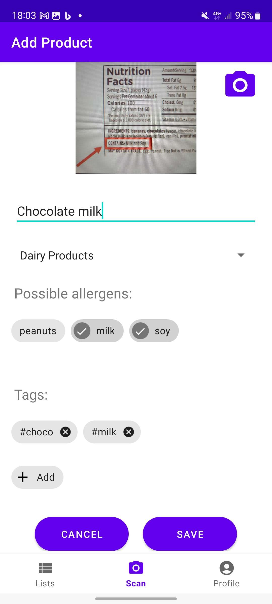

# Allergen Detector App

Welcome to the Allergen Detector app! This app was created as a Bachelor project of VIA University College by two Software Engineering students:
<li>Aleksandrs Bistrovs &nbsp; 304542</li>
<li>Maksims Fokins &nbsp; &nbsp; &nbsp; &nbsp; 305032</li>

<br>

The main goal of this app is to help users identify their potential allergies in food products to avoid dangerous situations and visits to ER.

---

### Overview

Project is split into 2 parts: Android app and ML model (OCR)

App enables its users to input their allergens and run the allergen detection logic by capturing images of the product ingredients first and then using this captured image on a pre-trained Convolutional Neural Network (CNN) to detect the text and potentially harmful ingredients.

### Features

- **Authorization:** Secure your account and retrieve your data when using the app from different device.

- **Image Capture:** Take picture using camera of the device.

- **Image Crop/Resize:** Possibility to select a specific region within the image.

- **Existing Image Scan:** Lets you perform scans on the images from the gallery.

- **Text Detection & Recognition:** Detects the text on the image using ML model and recognizes its content.

- **Correct Detected Text:** Lets you edit detected text in case of errors.

- **Allergen Detection:** Checks detected text for potential harmful ingredients and notifies the user.

- **Save Products:** Possibility to save harmful/harmless products to the list and share it with your family or friends when they go shopping for you.

- **Product Search:** Lets you search your lists by product name, category or tags. Lists can be filtered (harmful/harmless).

- **Personalization:** Users can update their allergen lists, upload avatars, change passwords to enhance their security, set various preferences like enabling dark mode or hints to further personalize their experience.

- **Text-to-Speech:** Possibility for the ones in need to enable text-to-speech to read the results of the scans aloud.

- **Statistics:** Check out your statistics in form of app usage - how many scans are made over time, see the distribution of harmful/harmless scans.

---

### Screenshots

   
  
  
  
  
  
  
  
  
  

---

### Enjoy!

Feel free to clone the repo to your local machine and find some inspiration.
   ```bash
   git clone https://github.com/helloItsBob/AllergenDetector.git
